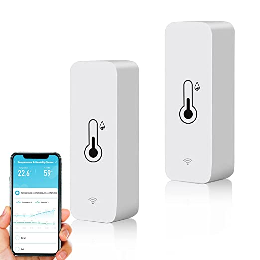

# WLAN-Smart-Thermometer-reverse-engineering
WLAN Smart Thermometer Hygrometer Reverse Engineered
Work in Progress

The device uses a CB3S Chip for Bluetooth and Wifi.
The Temperature & Humidity is measured with an AHT20 via I²C.

PCB:

